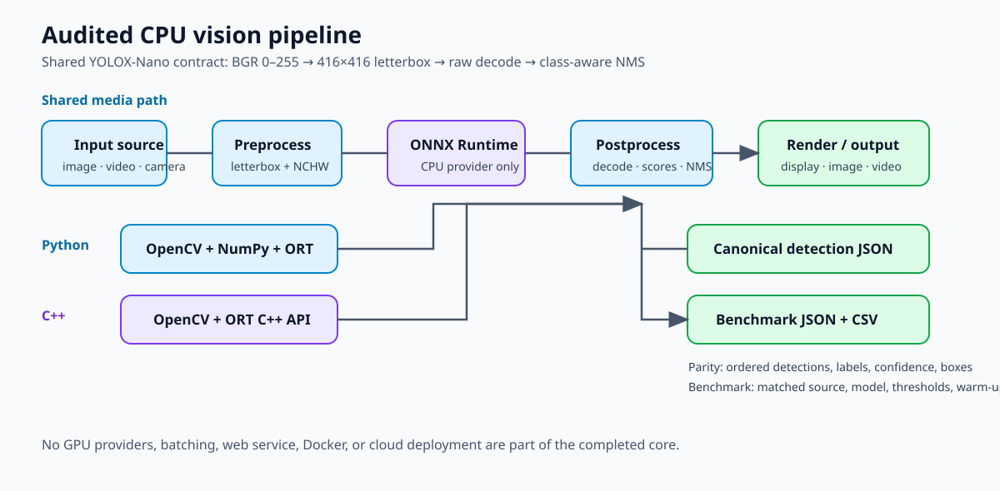
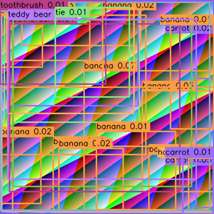

# C++ / Python ONNX Vision Pipeline

A reproducible CPU-only comparison of the same audited YOLOX-Nano detector in Python and modern C++. Both programs accept images, videos, and camera indexes; run the same preprocessing and postprocessing contract; export canonical detections for parity; and emit compatible benchmark results.



## What is verified

- Python 3.11+ and C++17 media pipelines with deterministic OpenCV resource cleanup.
- Image/video/camera input, headless mode, interactive Q/ESC exit, output staging, and passthrough operation without a model.
- One reusable ONNX Runtime `CPUExecutionProvider` session per detector run.
- Audited YOLOX-Nano `[1,3,416,416]` float32 input and `[1,3549,85]` raw output contract.
- Canonical Python/C++ detection comparison on the tracked `assets/sample/parity.png`: 32 ordered detections within an absolute `1e-5` tolerance. See [docs/PARITY.md](docs/PARITY.md).
- One validated, host-specific 30-frame comparative benchmark. See [benchmarks/REPORT.md](benchmarks/REPORT.md).

## Architecture and structure

The repository-native [architecture diagram](docs/architecture.svg) shows the shared stages: input → BGR letterbox/preprocess → ONNX Runtime CPU → decode/NMS → render/output, with canonical parity JSON and benchmark JSON/CSV outputs.

```text
assets/       Generated legal fixtures
benchmarks/   Comparative runner and measured report
cpp/          C++17/OpenCV/ONNX Runtime implementation and tests
docs/         Model, parity, benchmarking, architecture, troubleshooting, portfolio notes
models/       Label list, upstream notice, local ignored model destination
python/       Python package and pytest suite
scripts/      Setup, model acquisition, and parity helpers
```

## Prerequisites

- Linux x86-64 for the pinned C++ ONNX Runtime archive.
- Python 3.11+ (`PYTHON_BIN` can name a compatible interpreter).
- CMake 3.20+, C++17 compiler, OpenCV 4 development files, `curl`, `tar`, and `pkg-config` for C++.
- Network access only for first-time model and C++ runtime downloads.

The local setup scripts keep the Python environment in ignored `python/.venv` and the C++ runtime in ignored `third_party/onnxruntime`; neither is installed system-wide.

## Fresh-clone setup

```bash
# Create the Python 3.11+ environment and install package/test dependencies.
PYTHON_BIN=python3.11 scripts/setup_python.sh

# Download and verify the audited model into ignored models/detector.onnx.
python/.venv/bin/python scripts/download_or_export_model.py

# Download the pinned C++ CPU runtime and configure an out-of-tree build.
scripts/setup_cpp.sh
cmake -S cpp -B /tmp/vision-build -DCMAKE_BUILD_TYPE=Release \
  -DONNXRUNTIME_ROOT="$PWD/third_party/onnxruntime"
cmake --build /tmp/vision-build -j2
```

The model helper verifies 3,659,407 bytes and SHA-256 `c789161ed43c8269fcd4e67c67eeeb4e80c622da2eb296a20bc6007bd18a0b7d`. The complete contract and provenance are in [docs/MODEL.md](docs/MODEL.md).

## Run the pipelines

```bash
# Python detector: headless annotated image.
python/.venv/bin/python -m vision_pipeline \
  --model models/detector.onnx --labels models/classes.txt \
  --source assets/sample/parity.png --output outputs/python.png --no-display

# C++ detector: same model and source.
/tmp/vision-build/vision_cpp \
  --model models/detector.onnx --labels models/classes.txt \
  --source assets/sample/parity.png --output outputs/cpp.png --no-display

# Either implementation without --model is the original-frame passthrough path.
python/.venv/bin/python -m vision_pipeline --source assets/sample/benchmark.avi --no-display --max-frames 10
/tmp/vision-build/vision_cpp --source assets/sample/benchmark.avi --no-display --max-frames 10
```

`--source` accepts a non-negative camera index, supported local image, or supported local video. `--confidence` and `--iou` are finite values in `[0,1]`; `--max-frames` is positive. `--no-display` is required for benchmarks and appropriate for servers.

## Parity and benchmarking

```bash
# Requires the local audited model, labels, and built C++ executable.
python/.venv/bin/python scripts/check_parity.py \
  --python python/.venv/bin/python --cpp /tmp/vision-build/vision_cpp \
  --model models/detector.onnx --labels models/classes.txt \
  --image assets/sample/parity.png --work-dir /tmp/vision-parity

# Runs and validates both real CLIs with the same fixture/settings.
python/.venv/bin/python benchmarks/run_benchmarks.py \
  --python python/.venv/bin/python --cpp /tmp/vision-build/vision_cpp \
  --model models/detector.onnx --labels models/classes.txt \
  --source assets/sample/benchmark.avi --frames 30 --warmup 5 \
  --results-dir /tmp/vision-benchmark-results
```

The tracked benchmark video is project-generated, 416×416, 15 FPS, 40-frame MJPG. The runner writes only to its caller-selected results directory and rejects incompatible model, source, provider, thresholds, or counts.

## Validation

```bash
bash -n scripts/setup_python.sh scripts/setup_cpp.sh scripts/smoke_test.sh
python/.venv/bin/ruff format --check python scripts benchmarks
python/.venv/bin/ruff check python scripts benchmarks
python/.venv/bin/pytest python/tests

scripts/setup_cpp.sh
cmake -S cpp -B /tmp/vision-build -DCMAKE_BUILD_TYPE=Release \
  -DONNXRUNTIME_ROOT="$PWD/third_party/onnxruntime"
cmake --build /tmp/vision-build -j2
ctest --test-dir /tmp/vision-build --output-on-failure
```

## Visual evidence



The image is reproducible from the downloaded audited model and tracked fixture:

```bash
python/.venv/bin/python -m vision_pipeline \
  --model models/detector.onnx --labels models/classes.txt \
  --source assets/sample/parity.png --output docs/images/detector-parity.png \
  --no-display --confidence 0.01 --iou 0.45
```

The low confidence threshold is used only to make the synthetic fixture’s model outputs visible; it does not establish detector accuracy.

## Limits and provenance

- CPU-only, one audited static YOLOX-Nano model, fixed 416×416 batch-one contract. No GPU providers, batching, web service, Docker, cloud, or optional extensions are included.
- The YOLOX source is Apache-2.0, but the exact ONNX release asset has no separate model card or weight license. The repository does not redistribute model weights. [models/README.md](models/README.md) and [docs/MODEL.md](docs/MODEL.md) record the evidence.
- Original repository code and project-authored documentation are licensed under Apache-2.0; see [LICENSE](LICENSE) and [NOTICE](NOTICE). Third-party attribution remains separate.
- Video encoding/decoding depends on local OpenCV/codec support. GUI use needs a desktop/OpenCV GUI backend; camera operation depends on attached hardware and is mocked in tests.
- The parity result covers the audited model, fixed image, CPU providers, and documented configuration. Benchmark results are one host-specific run and vary with CPU, scheduling, OpenCV, codec, and ONNX Runtime builds.

See [docs/PORTFOLIO.md](docs/PORTFOLIO.md) for a concise project summary and [docs/TROUBLESHOOTING.md](docs/TROUBLESHOOTING.md) for setup recovery steps. Phase 9 optional extensions have not started.
